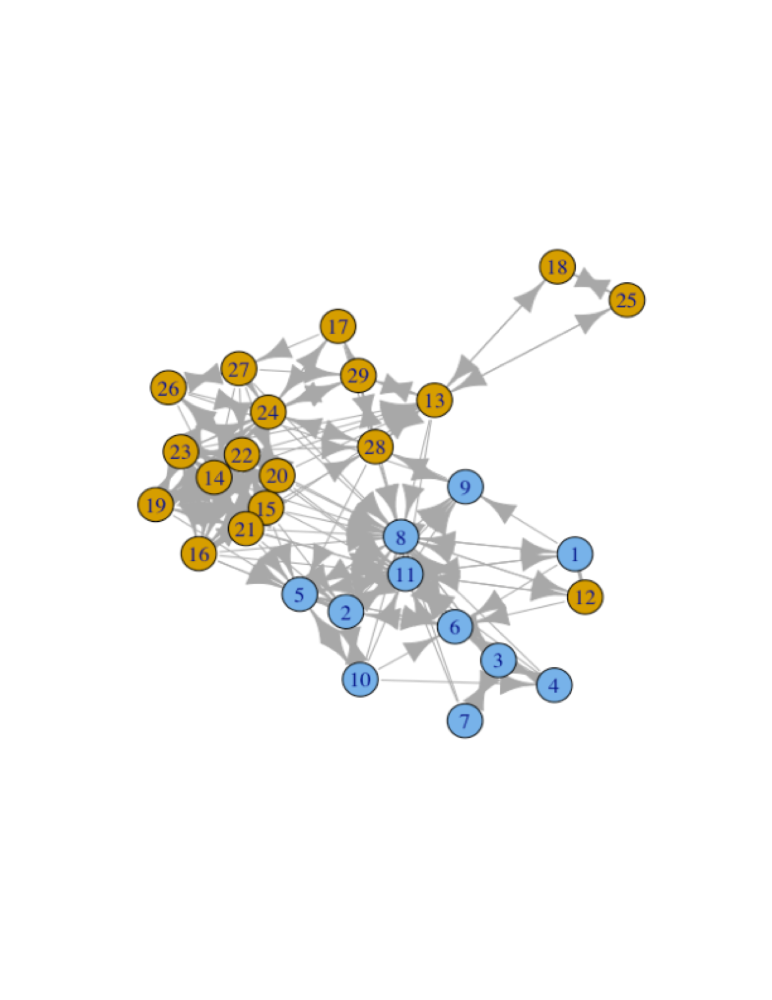
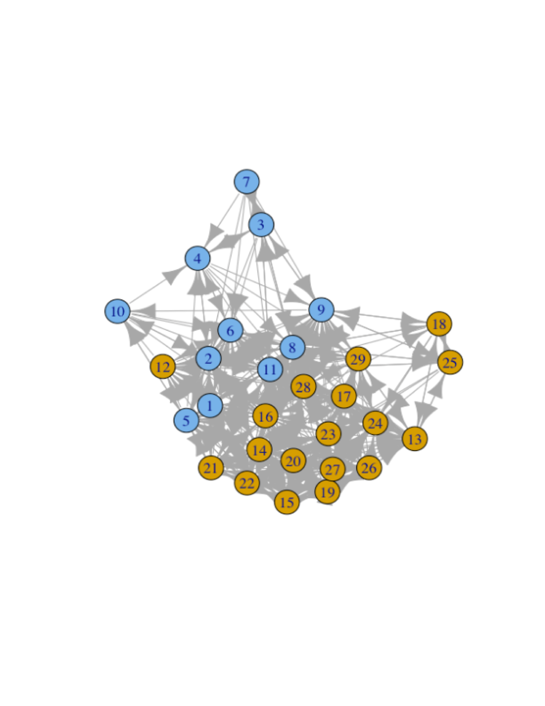
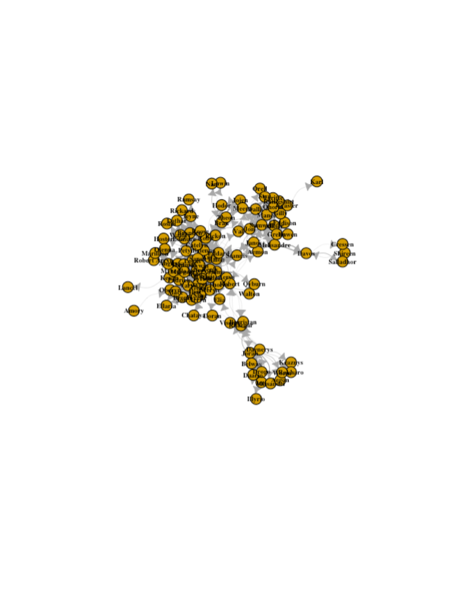
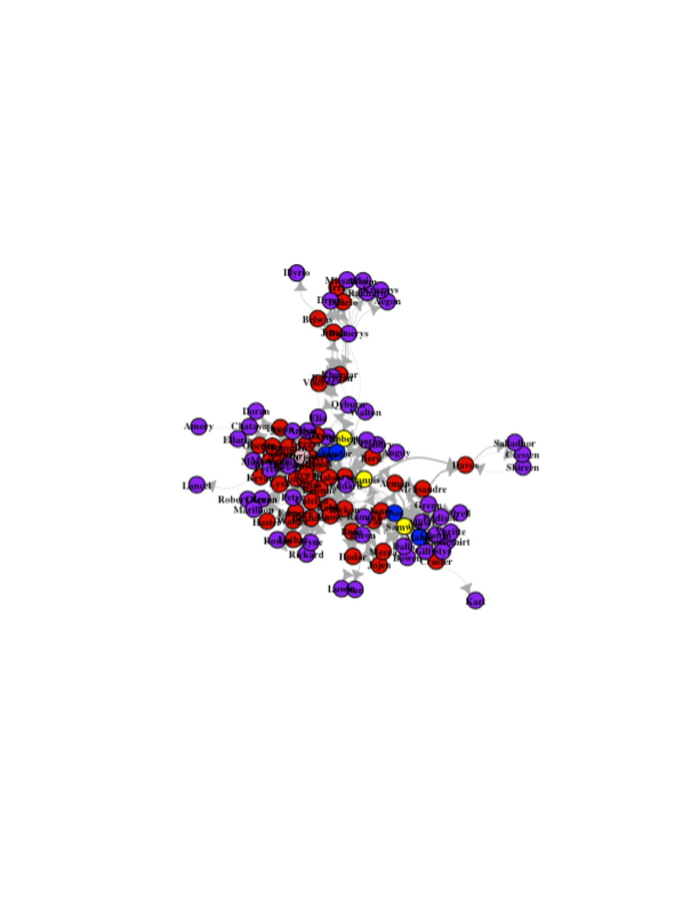
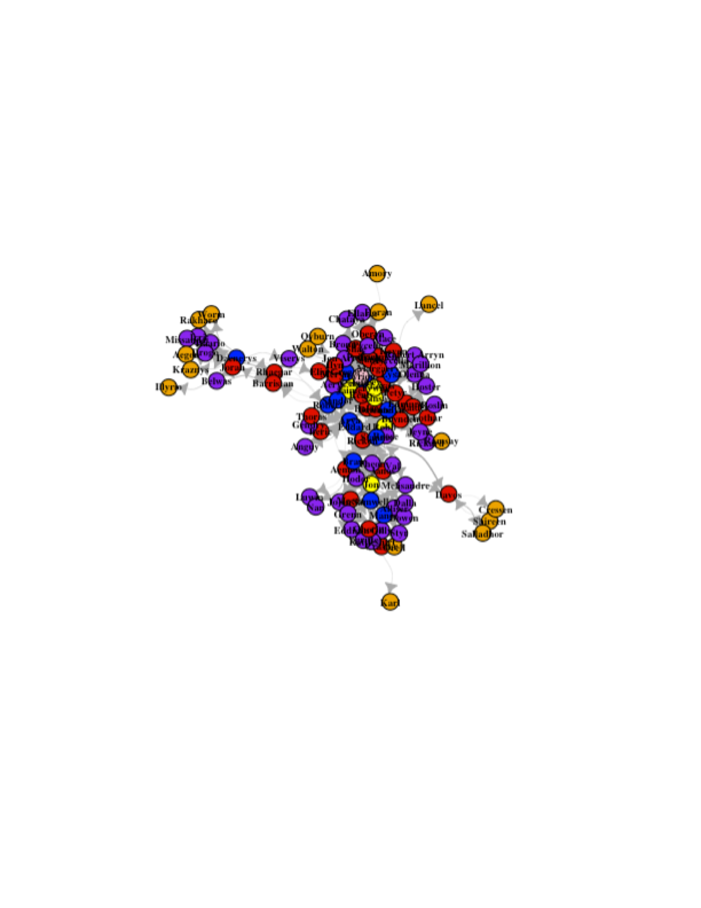

# Social Network Analysis

Social network anlaysis has found utility is institutional, classroom and analyses of networked data in socially-based educational games. However, the utility of the method largely rests on being able to ascribe meaning to the **structure of the network**. Without meaningful interpretation of structure there is no added value to a networked model, you will find more suvccess simply regressing your outcome against student characteristics.  Understanding measures of centrality and network structure in SNA are therefore an important, though difficult, aspect of the method. As with all SNA work, the vocabulary can be daunting though the ideas are relatively intuitive.

## Goals

* Be able to generate a basic sociogram
* Be able to apply and interpret a range of centrality measures to a network
* Be able to apply and interpret a range of clustering procedures to a network

## Creations

Worked towards building several social network diagrams (graphs/sociograms) of a school classroom and then analyzing both centrality measures and clusters within the network.
* Best Friend Social-Network

* Gets On With Social-Network

Created a social network analysis for Game of Thrones data.
* Social-Network

* Betweenness

* Degree

## Utilized the following resources

## Videos

[Williams, N. (2014). Basics of Social Network Analysis.](https://www.youtube.com/watch?v=PT99WF1VEws)

[Complexity Labs. (2015). Social Network Analysis Overview.](https://www.youtube.com/watch?v=fgr_g1q2ikA)

[Complexity Labs. (2015). Network Centrality.](https://www.youtube.com/watch?v=NgUj8DEH5Tc)

[Complexity Labs. (2015). Network Clustering & Connectedness.](https://www.youtube.com/watch?v=2Oa7mef77nM)

### Readings

[Bakharia, A., & Dawson, S. (2011). SNAPP: A Bird’S-eye View of Temporal Participant Interaction. In Proceedings of the 1st International Conference on Learning Analytics and Knowledge (pp. 168–173). Banff, Alberta, Canada:ACM.](https://doi.org/10.1145/2090116.2090144)

[Hanneman, R. & Riddle, M. (2005). Introduction to Social Network Methods. Riverside, CA:  University of California, Riverside](http://faculty.ucr.edu/~hanneman/)  
  * [Chapter 10: Centrality & Power](http://faculty.ucr.edu/~hanneman/nettext/C10_Centrality.html)  
  * [Chapter 11: Cliques & Subgroups](http://faculty.ucr.edu/~hanneman/nettext/C11_Cliques.html)  

[iGraph. (2016). Get Started with R iGraph](http://igraph.org/r/#docs)

[Social Network Analysis with R - Examples](https://www.youtube.com/watch?v=0xsM0MbRPGE)
